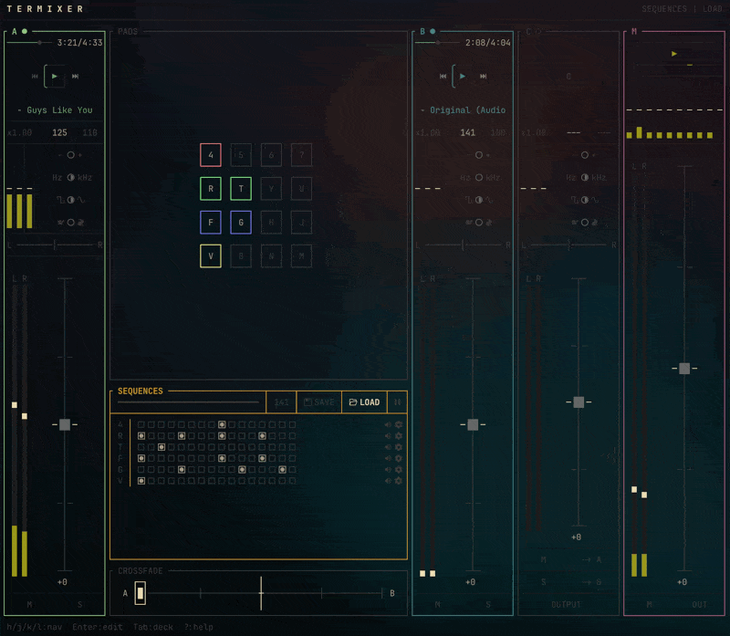

# termixer

A terminal-based DJ mixer for live performance with [TidalCycles](https://tidalcycles.org/). Built in Rust with [ratatui](https://ratatui.rs/), it provides real-time EQ, filtering, crossfading, and sample pads for mixing audio from MPV and SuperCollider.



## Features

- **Dual-deck mixer** with per-channel fader, pan, 3-band EQ, LPF/HPF
- **DJ center** with crossfader, cue mix, headphone/booth outputs
- **Microphone input** with selectable device, gain, and mute toggle
- **Sample pads** — 4x4 grid with sequencer
- **Auto-discovery** of MPV sockets, SuperCollider, PulseAudio, PipeWire, JACK sources
- **SuperCollider integration** — custom SynthDefs for mixer channel processing
- **Vim navigation** — hjkl throughout, 3-level mode system

## Prerequisites

- **Rust**
- **[Nerd Fonts](https://www.nerdfonts.com/)** — required for icons (rewind, fast-forward, etc.)
- **MPV** — media playback with IPC socket support
- **SuperCollider** (optional) — for TidalCycles integration

## Installation

### From crates.io

```bash
cargo install termixer
```

### From source

```bash
git clone https://github.com/l00sed/termixer.git
cd termixer
cargo install --path .
```

## Build

```bash
cargo build              # debug
cargo build --release    # optimized with LTO
```

## Usage

```bash
# Auto-discover audio sources
cargo run

# Specify MPV sources explicitly
cargo run -- -s "Deck A" /tmp/mpv-a.sock -s "Deck B" /tmp/mpv-b.sock

# With music and samples directories
cargo run -- -m ~/Music -S ~/Samples
```

### Starting MPV with IPC

```bash
mpv --input-ipc-server=/tmp/mpv-music.sock music.mp3
```

There's also an `mpv` wrapper script included that you can use to automatically enable the necessary flags just by setting the `TM` environment variable:

```bash
TM=1 mpv music.mp3
```

Termixer should automatically install this wrapper script to `~/.local/bin/mpv`. When `TM=1`, it will add the socket and pcm flags. Without it, `mpv` runs normally.

To manage your own `mpv` config and disable automatic seeding of `~/.config/mpv/scripts/` and `~/.config/mpv/mpv.conf`, use `export TM_NO_CONFIG=1` in your shell profile.

### Pads/Samples/Sequences

**NOTE**: Termixer uses the default [SuperDirt](https://github.com/tidalcycles/Dirt-Samples/) samples installation directory by default. It's a great, free library to grab some starter samples.

macOS — ~/Library/Application Support/SuperCollider/downloaded-quarks/Dirt-Samples
Linux — ~/.local/share/SuperCollider/downloaded-quarks/Dirt-Samples

Change the sample directory with `termixer -S PATH`.

Pad and sequence configurations can be exported to `.json` files and imported later to restore all saved samples, pad settings, and sequences.


### CLI Options

| Flag | Description |
|------|-------------|
| `-s, --source NAME SOCKET` | Add an audio source (MPV IPC socket) |
| `-m, --music-dir PATH` | Directory for audio file browser |
| `-S, --samples-dir PATH` | Directory for sample pad files |
| `-d, --discover` | Auto-discover audio sources (default) |
| `-h, --help` | Show help |

## Keyboard Controls

### Navigation

| Key | Action |
|-----|--------|
| `Tab` / `h` / `l` | Switch between panes (Deck A, DJ, Deck B, Master) |
| `Enter` | Enter control select mode |
| `Esc` | Go back one level |
| `?` | Toggle help overlay |
| `q` | Quit |

### Controls

| Key | Action |
|-----|--------|
| `j` / `k` | Navigate controls up/down |
| `h` / `l` | Adjust value / toggle EQ kill switch |
| `J` / `K` | Coarse adjustment (0.2) |
| `+` / `-` | Fine adjustment (0.05) |
| `m` / `s` | Toggle mute / solo |
| `c` | Center pan or crossfader |
| `0` | Reset control to default |

### Source & Sample Pads

| Key | Action |
|-----|--------|
| `A` | Open source picker for Deck A |
| `B` | Open source picker for Deck B |
| `P` | Toggle sample pads mode |

## Development

Check changes and run the test suite before opening a pull request:

```bash
cargo check
cargo test
cargo clippy -- -D warnings
```

Run Termixer with `DEBUG=1` while developing behavior, state synchronization, or audio routing:

```bash
DEBUG=1 cargo run
```

Debug mode enables the in-app debug pane and preserves diagnostic logging that is otherwise redirected to prevent stderr from corrupting the TUI. Clippy is run with warnings treated as errors to keep new code lint-clean.

## License

MIT
